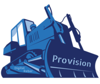

.. Copyright (c) 2017 RackN Inc.
.. Licensed under the Apache License, Version 2.0 (the "License");
.. DigitalRebar Provision documentation under Digital Rebar master license
..

.. _rs_welcome:

Digital Rebar Provision
~~~~~~~~~~~~~~~~~~~~~~~

*simple, fast and open API-driven server provisioning.*

`Digital Rebar Provision (DRP) <https://rebar.digital>`_ is a `APLv2 <https://raw.githubusercontent.com/digitalrebar/provision/master/LICENSE>`_ simple Golang executable that provides a simple yet complete API-driven DHCP/PXE/TFTP provisioning and workflow system.

DRP is designed to be a complete data center provisioning, content scaffolding and infrastructure workflow platform with a cloud native architecture that completely replaces Cobbler, Foreman, MaaS or similar technologies. DRP offers a single golang binary (less than 30MB) with no dependencies capable of installation on a laptop, RPi or switch supporting both bare metal and virtualized infrastructure.

Key Features:

   * API-driven infrastructure-as-code automation
   * Multi-boot workflows using composable and reusable building blocks
   * Event driven actions via Websockets API
   * Extensible Plug-in Model for public, vendor and internal enhancements
   * Supports ALL orchestration tools including Chef, Puppet, Ansible, SaltStack, Bosh, Terraform, etc
   * RAID, IPMI, and BIOS Configuration (via commercial plugins)

.. _rs_community:

Community Resources from https://rebar.digital
----------------------------------------------

.. image:: https://travis-ci.org/digitalrebar/provision.svg?branch=master
  :target: https://travis-ci.org/digitalrebar/provision
  :alt: Build Status

.. image:: https://codecov.io/gh/digitalrebar/provision/branch/master/graph/badge.svg
  :target: https://codecov.io/gh/digitalrebar/provision
  :alt: codecov

.. image:: https://goreportcard.com/badge/github.com/digitalrebar/provision
  :target: https://goreportcard.com/report/github.com/digitalrebar/provision
  :alt: Go Report Card

.. image:: https://godoc.org/github.com/digitalrebar/provision?status.svg
  :target: https://godoc.org/github.com/digitalrebar/provision
  :alt: GoDoc

.. image:: https://readthedocs.org/projects/provision/badge/?version=stable
  :target: http://provision.readthedocs.io/en/stable/?badge=stable
  :alt: Documentation STABLE Status

.. image:: https://readthedocs.org/projects/provision/badge/?version=latest
  :target: http://provision.readthedocs.io/en/latest/?badge=latest
  :alt: Documentation Latest Status

* Chat/messaging via the Digital Rebar ``#community`` channel is our preferred communication method.  If you do not have a Slack invite to our channel, you can `Request a Slack Invite <http://www.rackn.com/support/slack/>`_
* Alternate chat vi Gitter `Live Chat <https://gitter.im/digitalrebar/core?utm_source=badge&utm_medium=badge&utm_campaign=pr-badge&utm_content=badge>`_  (Gitter.im) and IRC on Freenode #DigitalRebar
* `Issues and Features <https://github.com/digitalrebar/provision/issues>`_
* Full `Documentation <http://provision.readthedocs.io/en/stable/>`_ (Github `/doc <https://github.com/digitalrebar/provision/tree/master/doc>`_ sources are updatable via pull request).
* Videos on the `DR Provision Playlist <https://www.youtube.com/playlist?list=PLXPBeIrpXjfilUi7Qj1Sl0UhjxNRSC7nx>`_ provide both specific and general background information.

.. _rs_quick:

Install & Quick Start
---------------------

.. note::  We HIGHLY recommend using the ``latest`` version of the documentation, as it contains the most up to date information.  Use the version selector in the lower right corner of your browser.

Our `Stable Quick Start <http://provision.readthedocs.io/en/stable/doc/quickstart.html>`_ has fast play-with-it steps.  Don't worry, they are very simple and take 10 to 20 minutes.

Want the `Latest Quick Start <http://provision.readthedocs.io/en/tip/doc/quickstart.html>`_? You'll have access to the newest features in tested work for the next release.  This is NOT the bleeding edge!

Regular `Install <http://provision.readthedocs.io/en/latest/doc/install.html>`_ for more details on the install steps.  These include production options. (`Previous Version Docs <http://provision.readthedocs.io/en/latest/doc/quickstart.html>`_)

Components & Extensions
-----------------------

Digital Rebar Provision is composable by design.  Much of our advanced funtionality is exposed in :ref:`rs_content_packages` that are added into the system as content and plugins which have documentation embedded in the extension.

.. _rs_toc:

Table of Contents
-----------------

**Reading on Github?** Visit `Generated Docs <http://provision.readthedocs.io/en/stable/README.html#rs_toc>`_ for a generated ToC.

.. toctree::
   :includehidden:
   :numbered:
   :maxdepth: 1

   doc/quickstart
   doc/install
   doc/setup/index
   doc/features
   doc/server
   doc/configuring
   doc/release
   doc/upgrade
   doc/workflows
   doc/deployment
   doc/operation
   doc/performance/intro
   doc/os-support
   doc/os-support/linuxkit
   doc/ui
   doc/ux/portalux
   doc/Swagger
   doc/cli
   doc/api
   doc/dev/dev-server
   doc/dev/dev-cli
   doc/dev/dev-docs
   doc/faq-troubleshooting
   doc/arch
   doc/integrations
   doc/content-packages
   CONTRIBUTING
   Trademark
   LICENSE

.. _rs_license:

License
-------
DigitalRebar Provision code is available is available from multiple authors under the `Apache 2 license <https://raw.githubusercontent.com/digitalrebar/provision/master/LICENSE>`_.

Digital Rebar Provision Documentation is available from multiple authors under the `Creative Commons license <https://en.wikipedia.org/wiki/Creative_Commons_license>`_ with Attribution.

::

    Work licensed under a Creative Commons license is governed by applicable copyright law.
    This allows Creative Commons licenses to be applied to all work falling under copyright,
    including: books, plays, movies, music, articles, photographs, blogs, and websites.
    Creative Commons does not recommend the use of Creative Commons licenses for software.

    However, application of a Creative Commons license may not modify the rights allowed by
    fair use or fair dealing or exert restrictions which violate copyright exceptions.
    Furthermore, Creative Commons licenses are non-exclusive and non-revocable.
    Any work or copies of the work obtained under a Creative Commons license may continue
    to be used under that license.

    In the case of works protected by multiple Creative Common licenses,
    the user may choose either.
