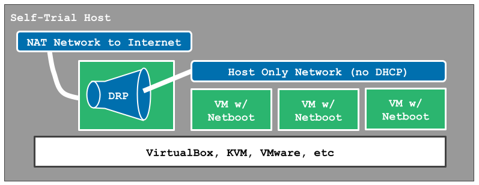

.. Copyright (c) 2021 RackN Inc.
.. Licensed under the Apache License, Version 2.0 (the "License");
.. Digital Rebar documentation under Digital Rebar master license
.. index::
  pair: Digital Rebar Provision; Quick Start

.. _rs_quickstart:

Quick Start
~~~~~~~~~~~

This quick start guide provides a streamlined self-trial installation via `systemd <https://en.wikipedia.org/wiki/Systemd>`_ on Mac OS, Linux OS, Linux VMs and Cloud Servers.  Many advanced options are including air-gap, local UX, using another DHCP are available but outside of this scope.

We recommend consulting the `video guide <https://youtu.be/v-KcvYrUoE0>`_ of this process during the installation and our `advanced features showcase <https://www.youtube.com/playlist?list=PLXPBeIrpXjfigvrXEQIJxXmFdTHqobooH>`_.

Most Digital Rebar environments require knowledge of your network and DHCP environment.  Cloud and fully Virtual environments generally require less networking knowledge.

Other installation paths to consider:

.. toctree::
   :maxdepth: 1
   :glob:

   install/install
   install/install-dev
   install/install-docker
   install/install-cloud

This graphic shows the basic layout for a quick start system:

.. _rs_qs_preparation:

Prepare Your Environment
------------------------

This quick start guide will install the latest stable release of Digital Rebar onto a Linux or MacOS system as a `systemd <https://en.wikipedia.org/wiki/Systemd>`_ service running on port 8092 (these :ref:`rs_arch_ports` are used by default).

For a quick trial, we recommend using a dedicated Virtual Machine using `host only networking` on one interface for your trial.

* Linux or MacOS system (we recommend Centos 8, Windows is not supported)
* 4 Gb of RAM (minimum)
* 20 Gb of Disk Space (60 Gb is better because some O/S installation ISOs require much more space)
* Access to the internet to download components (*not* a requirement for production systems)
* Provisioning network without a DHCP server (Digital Rebar will provide DHCP by default)

If you are concerned about installing Digital Rebar as a service, please review our :ref:`rs_install_dev` guide to run it isolated in a single directory.

You must install Digital Rebar to use it, there is no SaaS version.  :ref:`rs_self_managed_why`

.. _rs_qs_install:

Install Digital Rebar Endpoint
------------------------------

To begin, execute the following commands in a shell or terminal:

.. code-block:: bash

    curl -fsSL get.rebar.digital/stable | bash -s -- install --systemd --version=stable

The command will download the stable Digital Rebar (the ``systemctl`` service name is ``dr-provision``) bundle and checksum from github, extract the files, verify prerequisites are installed, and create needed directories and links under ``/var/lib/dr-provision``.  The ``--systemd`` and ``--version`` flags included for clarity, they are not required for this install.

The `install <http://get.rebar.digital/stable/>`_ script used by our installs has many additional options including ``remove`` that are documented in its help and explored in other install guides.

Once the installation script completes, a Digital Rebar endpoint will be running your local system!

.. _rs_qs_license:

Open the RackN UX & Trial License 
---------------------------------

All Digital Rebar operations are securely local and behind your firewall. RackN *never* has direct access to your DRP endpoint.

The Digital Rebar UX is hosted at `RackN <https://portal.rackn.io/>`_ as a convenience for new users.  RackN does not have access to your data, credentials or provisioning APIs because The RackN portal runs as a single-page app *locally* in your browser so all DRP API calls remain behind your firewall. 

To start, open new Digital Rebar API:

  ::

    https://<ip_address_of_your_endpoint>:8092/

You will be redirected to the `RackN Portal UX <https://portal.rackn.io>`_ after you visit the Digital Rebar API port and accept the self-signed certificate generated by the installation.

Then login Digital Rebar:

  ::

    username: rocketskates
    password: r0cketsk8ts

After login, you will be promoted to create and download a extendable self-trial license that enables most enterprise feature of Digital Rebar.  If you save the generated license file then you'll be able to use it to bypass this process in the future.

.. _rs_qs_ux_bootstrap:

UX System Bootstrap Wizard
--------------------------

On the top left section of the *Info & Preferences* page, the `RackN Portal <https://portal.rackn.io>`_ shows the steps needed to create a fully operational Digital Rebar endpoint.

A quick start system will have some initial configuration already done.  Work through the bootstrap check list until all items have green check marks.  The final *Machines* step requires actions outside of Digital Rebar, consult :ref:`rs_qs_first_machine` for assistance.

If you prefer command line actions over a UX, all of the UX Wizard steps can also be performed using the steps below.

.. _rs_qs_cli_bootstrap:

CLI System Bootstrap (optional)
-------------------------------

These :ref:`rs_cli` bootstrapping steps include the ones suggested by the install script.

To use DRPCLI, you need to set the target endpoint and credentials.  This can be done per call using command line flags; however, most users prefer to set environment variables for this purpose.

.. code-block:: bash

    export RS_ENDPOINT=https://<ip_address_of_your_endpoint>:8092/
    export RS_KEY=rocketskates:r0cketsk8ts

First, set a more secure password for your endpoint.

.. code-block:: bash

    mypass="D1gitalR3bar"
    drpcli users password rocketskates $mypass
    export RS_KEY=rocketskates:$mypass

Next, upload the discovery O/S (aka "sledgehammer") and set the defaults to use it.

.. code-block:: bash

    drpcli bootenvs uploadiso sledgehammer
    drpcli prefs set defaultWorkflow discover-base unknownBootEnv discovery

Note that ``drpcli bootenvs uploadiso`` command is a helper command that combines two common steps:  it fetchs the ISO referenced ISO in the bootenv from the internet and then uploads the ISO to Digital Rebar.  If you perform these steps many times, we recommend storing the downloaded ISO media locally and then uploading it using ``drpcli isos upload``.

Next, define the provisioning Subnet in Digital Rebar DHCP.  Since you _must_ include all of the necessary DHCP boot options to correctly PXE boot a Machine; we recommend using the UX to create Subnets because it has logic to determine sane defaults.

The following command line example contains the JSON Subnet and DHCP definitions.  You *MUST* modify the network parameters to match your environment.

.. code-block:: bash

    ###
    #  EXAMPLE - please modify the below values according to your environment  !!!
    ###

    echo '{
      "Name": "local_subnet",
      "Subnet": "10.10.16.10/24",
      "ActiveStart": "10.10.16.100",
      "ActiveEnd": "10.10.16.254",
      "ActiveLeaseTime": 60,
      "Enabled": true,
      "ReservedLeaseTime": 7200,
      "Strategy": "MAC",
      "Options": [
        { "Code": 3, "Value": "10.10.16.1", "Description": "Default Gateway" },
        { "Code": 6, "Value": "8.8.8.8", "Description": "DNS Servers" },
        { "Code": 15, "Value": "example.com", "Description": "Domain Name" }
      ]
    }' > /tmp/local_subnet.json

    vim /tmp/local_subnet.json

    drpcli subnets create - < /tmp/local_subnet.json

Finally, install one of these popular trial operating systems.

.. code-block:: bash

    drpcli bootenvs uploadiso ubuntu-20.04-install # optional, requires at least 3G of free space
    drpcli bootenvs uploadiso centos-8-install # optional, requires at least 30G of free space

We recommend reviewing the :ref:`rs_qs_ux_bootstrap` to ensure that all steps have been completed.

.. _rs_qs_first_machine:

Provision a Machine
-------------------

Create network bootable virtual machine (physical machines on the DHCP network will work too):

* with at least 2 Gb of RAM (4 Gb is preferred)
* set to network boot first
* attached to Digital Rebar provisioning network (aka Layer 2 subnet)

Power on the machine!  No further action is required.

The machine should boot in to the Sledgehammer discovery operating system.  Typically, the machine console looks like (the version signature may differ):

    ::

      Digital Rebar: Sledgehammer ###................................####
      Kernel 3.10.0-693.21.1.el7.x86_64 on an x86_64

      d0c-c4-7a-e5-48-b6 login:

After the boot is complete, the UX *Machines* page should show the newly discovered machine.

If you have installed another operating system ISO besides Sledgehammer, then you can now provision an operating system by setting the target workflow on the machine:

#. select the target machine (indicated with a check in the left most box)
#. select the target workflow from the action list at the top of the page (typically centos-base or ubuntu-base)
#. press the "Run Workflow" button (looks like a play icon next to the workflow list)

You should see immediate updates to the machine's stages and tasks as Digital Rebar processes the workflow.

After installation completes, you can quickly return to Sledgehammer by running the ``discover-base`` workflow.

.. _rs_qs_next_steps:

Advanced Features Catalog (next steps)
--------------------------------------

Digital Rebar is capable of automated workflow management of the boot process, power control, and much more.  This quickstart walks through the simplest process to get you up and running with a single test install.  Please review the rest of the documentation for further configuration details and information on automation of your provisioning environment.

The UX Catalog contains a list of available extensions to Digital Rebar that are avaible for installation.  Choosing an item from the Catalog will automatically download and install the capability.  All items run locally in your Digital Rebar endpoint, no connection to RackN is required after the download.

Fully automated provisioning control requires use of plugins for Power Management actions.  These are done through the IPMI subsystem, with a specific IPMI plugin for a specific environments.  Some existing plugins exist and are documented in :ref:`rs_setup`.

.. _rs_qs_cleanup:

Clean Up
--------

Once you are finished exploring Digital Rebar, you can uninstall the service 

.. code-block:: bash

    curl -fsSL get.rebar.digital/stable | bash -s -- remove

Note that ``remove`` will *not* remove the data files stored in ``/var/lib/dr-provision``, ``/etc/dr-provision``, or ``/usr/share/dr-provision``.  Include the ``--remove-data`` flag for a full clean-up.
