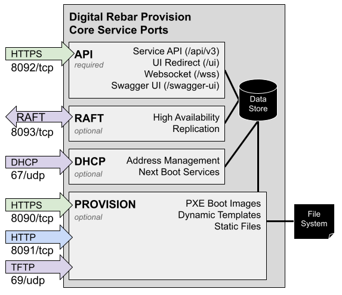

.. Copyright (c) 2017 RackN Inc.
.. Licensed under the Apache License, Version 2.0 (the "License");
.. Digital Rebar Provision documentation under Digital Rebar master license
.. index::
  pair: Digital Rebar Provision; Server Architecture

.. _rs_server_architecture:

Server Architecture
===================

Digital Rebar Provision is provided by a single binary that contains
tools and images needed to operate.  These are expanded on startup and
made available by the file server services.

Services
--------

Provisioning requires handoffs between multiple services as described
in the :ref:`rs_workflows` section.  Since several of services are
standard protocols (DHCP, TFTP, HTTP), it may be difficult to change
ports without breaking workflow.

The figure below illustrates the three core Digital Rebar Provision
services including protocols and default ports.  The services are:

#. Web - These services provide control for the other services

   #. API: REST endpoints with Swagger definition
   #. UI: User interface and Swagger helpers

#. DHCP: Address management includes numerous additional option fields
   used to tell systems how to interact with other data center
   services such as provisioning, DNS, NTP and routing.

#. Provision: sends files on request during provisioning process based on a template system:

   #. TFTP: very simple (but slow) protocol that's used by firmware
      boot processes because it is very low overhead.
   #. HTTP: faster file transfer protocol used by more advanced boot processes

.. _rs_arch_ports:

Ports
-----

The table describes the ports that need to be available to run Digital Rebar Provision.  Firewall rules may need to be altered to enable these services.  The feature column indicates when the port is required.  For example, the DHCP server can be turned off and that port is no longer required.

========  =======   =====================
Ports     Feature   Usage
========  =======   =====================
67/udp    DHCP      DHCP Port
69/udp    PROV      TFTP Port
8091/tcp  PROV      HTTP-base File Server
8092/tcp  Always    API and Swagger-UI
========  =======   =====================

All default ports can be changed at start up time of the ``dr-provision`` service.  NOTE that changing DHCP and TFTP ports has wide ranging implications and is likely not a good idea (many firmware implementations can not be changed to use alternate port numbers).

Port access requirements:

In all usage cases (67, 69, 8091, and 8092) the ports *from* the Machines being provisioned *to* the DRP Endpoint must be accessible.  The DRP Endpont must be able to reach the Machines being provisioned on port 67 for In addition, the API and Swagger-UI port must be accessible to any operator/administrator workstations or systems that are controlling and managing the DRP Endpoint service.  Additionally any services or integrations that interact with the DRP Endpoint (eg IPAM, DCIM, Asset Management, CMS, CMDB, etc) may need access to the API port.

