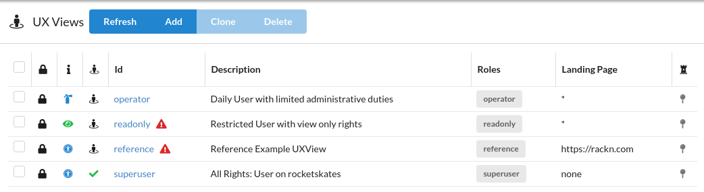
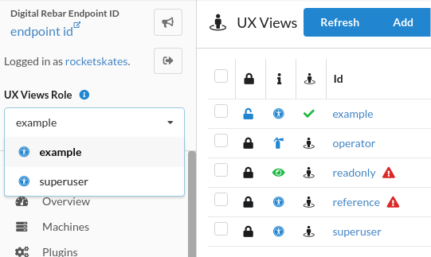
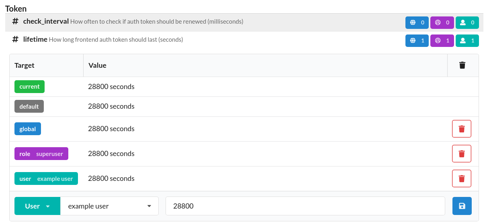
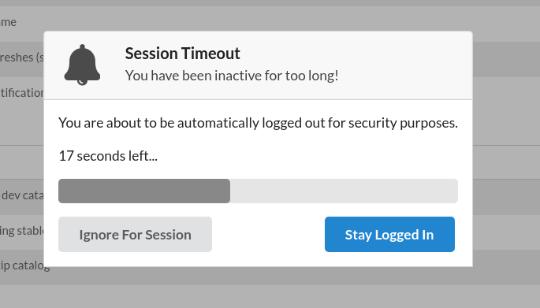
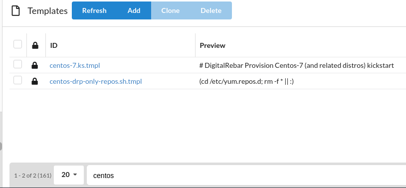
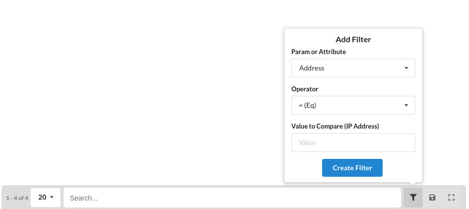
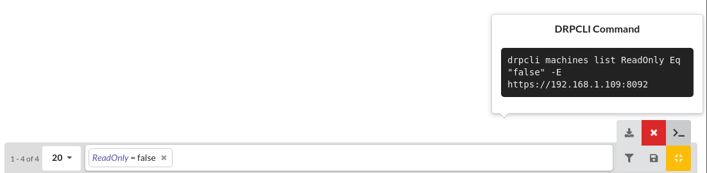

.. Copyright (c) 2020 RackN Inc.
.. Licensed under the Apache License, Version 2.0 (the "License");
.. Digital Rebar Provision documentation under Digital Rebar master license
.. index::
  pair: Digital Rebar Provision; UX

.. _rs_configux:

Configuration
=============

This document is an instructional guide for configuration of the RackN Portal. To edit UX configurations, the :ref:`rs_cp_ux_views` plugin must be installed. For more technical documentation of configurations, refer to that document.

UX Views
--------

The UX Views feature enables the UX to show custom side navigation trees based on a user's role. This is useful for limiting access to certain users.

The UX Views page can be navigated to by the "UX Views" link in the Endpoint Admin section of the sidenav.

Each row in the table denotes a different UX View. The columns are as follows:

* Read Only - Lock icon if true
* Icon - UX View Icon metadata
* Id - The name of this UX View, along with a red triangle if the no user has a role designated to this view.
* Description
* Roles - When a user has this role, they will be shown this UX View
* Landing Page - Default page shown to a user after sign in. 

By default, the first non-readonly view applicable to the current user will be selected.

If there is more than one UX View that can be applied to the user, a dropdown will be visible under the logout button on the top of the sidenav.

UX Config
---------

The UX Config feature allows tweaking of some UX functionality independent from DRP as well as the enabling of some security features.

The UX Config page can be navigated to by the "UX Config" link in the Endpoint Admin section of the sidenav.

This view is broken down into sections and options. By default, configurations of other users are not displayed unless either the eye icon next to "Collapse All" or the "+N more hidden rows" message at the bottom of an expanded option are clicked.

Each option row is broken down into the following sections:

* Type Icon - "A" for text, "#" for numeric, and a switch icon for toggle or boolean options.
* Option Name
* Option Description (and unit for numeric options)
* Scope counters
    * Blue globe - number of global settings (at most 1)
    * Purple person circle - number of role settings
    * Green person - number of user settings

.. image:: images/uxconfiglist.png
  :width: 800
  :alt: UX Config List

Each option entry row can be clicked to be expanded or collapsed.

Settings can be modified by selecting scope, inputting a value, and pressing the save button.

Settings can be removed by clicking the red trash can icon on the right side of the respective rows.

Inactivity Timer
~~~~~~~~~~~~~~~~

In the Security -> Inactivity section of the UX Config page are configurations for the inactivity timer. This timer will automatically sign users out after the configured amount of time if there is no mouse or keyboard activity.

A page refresh must be made after enabling the feature for it to take effect.

Filters
-------

Filters are shortcut filter configurations for table views.

By default, the filter field can be used as an ID search field.

Filters can be accessed by clicking the filter icon right side of the pagination menu at the bottom of most table views.

The expand button on the right can be clicked to reveal more options:

* Download - Download the current filter as a content package
* Clear - Remove all current filters
* CLI - Convert the current filter into a DRPCLI command

