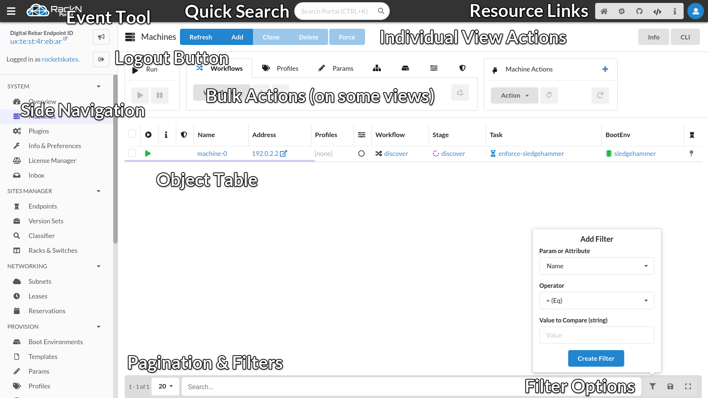
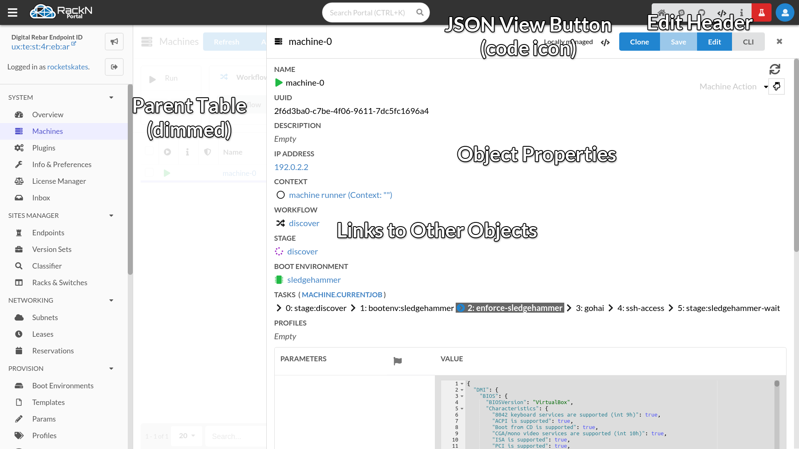
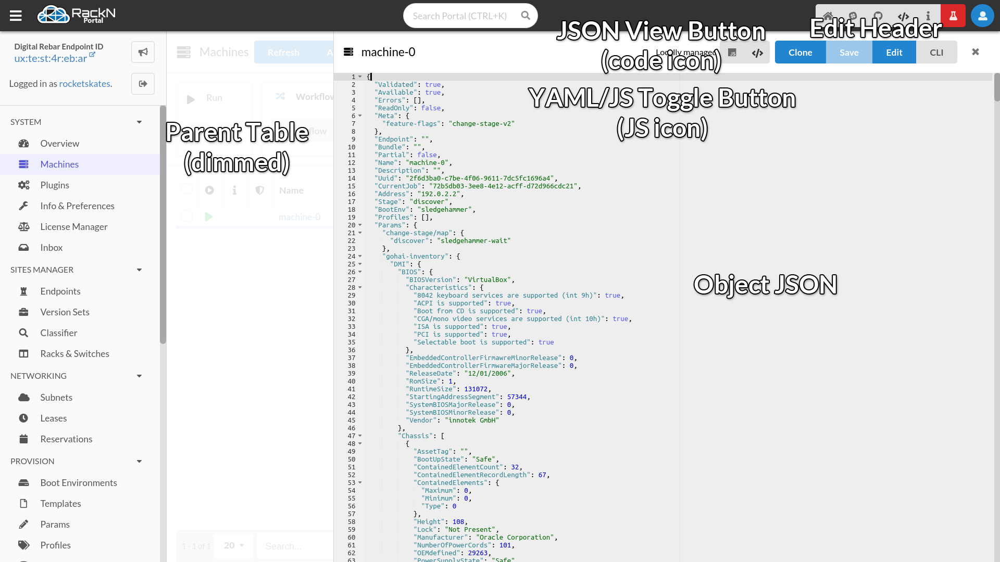
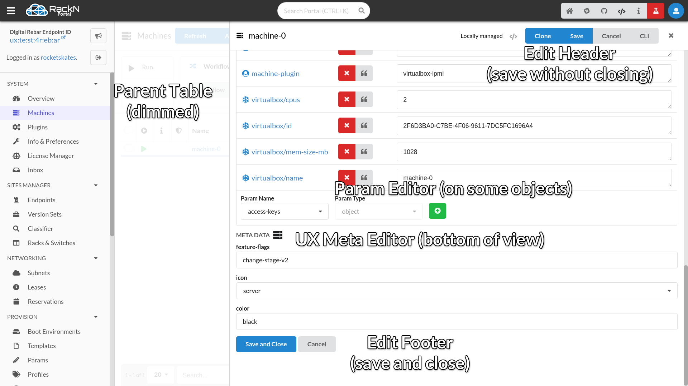

.. Copyright (c) 2017 RackN Inc.
.. Licensed under the Apache License, Version 2.0 (the "License");
.. Digital Rebar Provision documentation under Digital Rebar master license
.. index::
  pair: Digital Rebar Provision; UX

.. _rs_homeux:

Interface Overview
==================

The RackN Portal, or UX, is primarily navigated via the side navigation and in-interface hyperlinks. Below is a labeled screenshot of the Machines page outlining some key features of the interface.

Most views in the UX consist of:

* At the top, a header with blue action buttons (Most commonly refresh, add, and delete)
* In the middle, a table with objects fetched from the API
* At the bottom, a pagination, filter, and search section

Some tables have a "bulk actions" menu above for applying certain properties to multiple selected rows at a time.

Clicking on a link in the table typically redirect users to an individual view for that respective object. The link in the Name, or ID column correlate to the object represented by that row.

Links in this view reference individual views for other objects.

The header button with a code icon (</>) will toggle between the JSON/API representation view. When active, encoding can be toggled between JSON and YAML.

The Edit button opens an editable version of the object. Save buttons are located in the header and at the bottom of the view.

Clicking the close (x) icon will navigate back to the table for this object's type.

