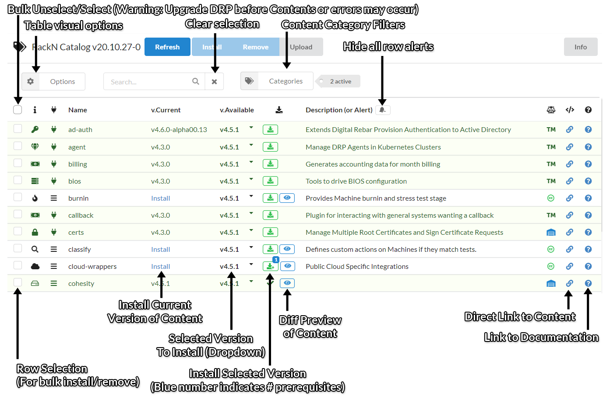
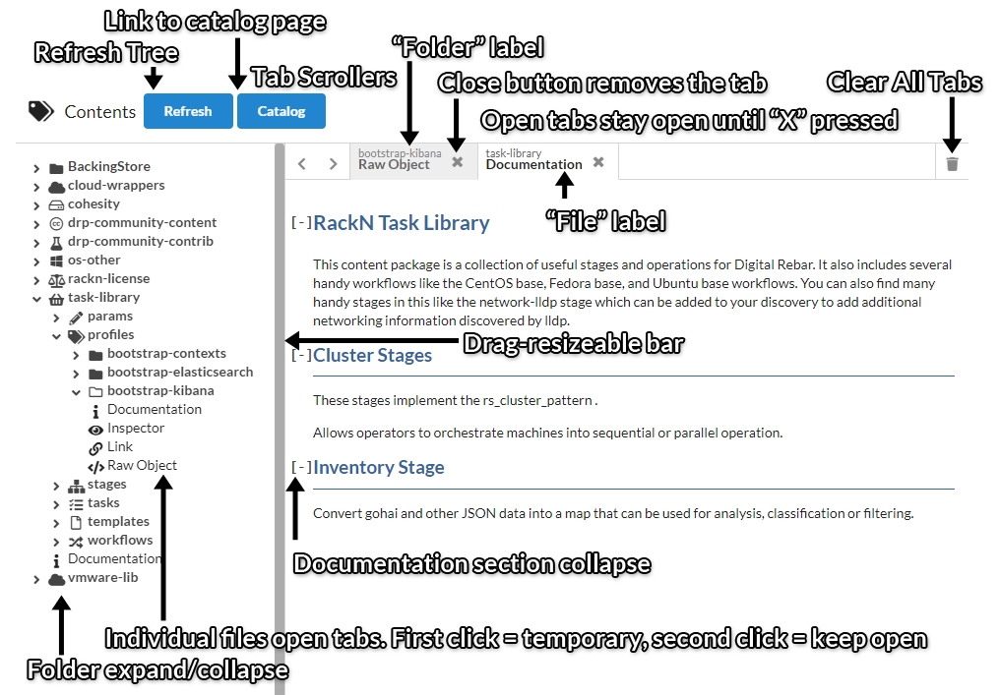

.. Copyright (c) 2017 RackN Inc.
.. Licensed under the Apache License, Version 2.0 (the "License");
.. Digital Rebar Provision documentation under Digital Rebar master license
.. index::
  pair: Digital Rebar Provision; UX

.. _rs_syncuploadux:

Synchronize and Upload
======================
This section contains information on the available content packages, ISOs, and Plugins available in the current DRP as well as tools not yet installed on this specific endpoint. 

Content Packages /  Catalog
---------------------------
The catalog provides a table showing both installed and available content. Rows that are green are
contents that are currently installed on the system.

The version of the catalog in use is displayed in the header.

The top of the page has a set of blue buttons for additional information:

* Refresh - Update the current list of information on the page
* Install - Install selected content rows
* Remove - Uninstall selected content rows
* Upload - Upload content from a file
* Options - Change table display options
    * Installed Only - Only display installed content
    * Not Installed - Only display not installed content
    * Show Internal - Show DRP Internal content
    * Display Names - Show package display names instead of display IDs
    * Short Versions - Truncate version extension off of table versions
* Search - Search all content regardless of selected categories 
* Categories - Toggle categories for available content

Content Package Information

* Preview - Provide a complete look into the Content Package including its Boot Envs, Params, Profiles, Stages, Tasks, and Templates. An option to see the raw JSON is also available
* Diff - Show the latest changes between the current and most recent version of the Content Package
* Download - Download the Content Package to latest (or other selected) version
* Remove - Remove the Content Package from the current DRP endpoint. Either by selecting multiple rows or using the version dropdown.

Here's an overview of clickable things in the catalog table. All links that do not navigate internally within the UX will open in a new tab.

Content Browser
----------------
The content browser displays all currently installed content on the system and allows navigation of
the objects.

The tree can be broken down into the following heirarchies:

* Top level (content) - Each folder represents content installed on the system
    * Documentation at this level is content-pack wide documentation
* Second level (sections) - Each folder contains objects bundled with the content
* Object level (objects) - Each entry at this level can be one of the following:
    * Template - displays the template in a read only code-editor
    * Object - displays the following options:
        * Documentation - At this level, documentation is per-object
        * Inspector - Look at the object in a read-only inspector
        * Link - Navigate to the potentially non-read-only inspector in the table view
        * Raw Object - Read YAML for this object with a few removed fields

Boot ISOs
---------
This page shows all available Boot ISOs and Images for the DRP endpoint to use. 

The top of the page has a set of blue buttons for additional information:

* Refresh - Update the current list of ISOs
* Upload - Add a new ISO image to the DRP endpoint
* Delete - Remove an ISO image from the DRP endpoint 

Support Files
-------------
These files are located on the DRP webserver and are available via TFTP to start the PXE boot on new machines.  

The top of the page has a set of blue buttons for additional information:

* Refresh - Update the current list of files and folders
* Upload - Add a new file/folder to the DRP endpoint
* Delete - Remove a file/folder from the DRP endpoint 

Rows in the table with the folder icon can be clicked to preview its respective folder.

Rows in the table with the file icon can be clicked to download the respective file.

The folder labeled ".." will go up one directory.

The blue links in the "Root / path / folder / names" header can be clicked to traverse parent folders.
