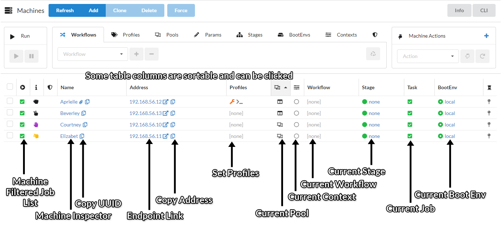
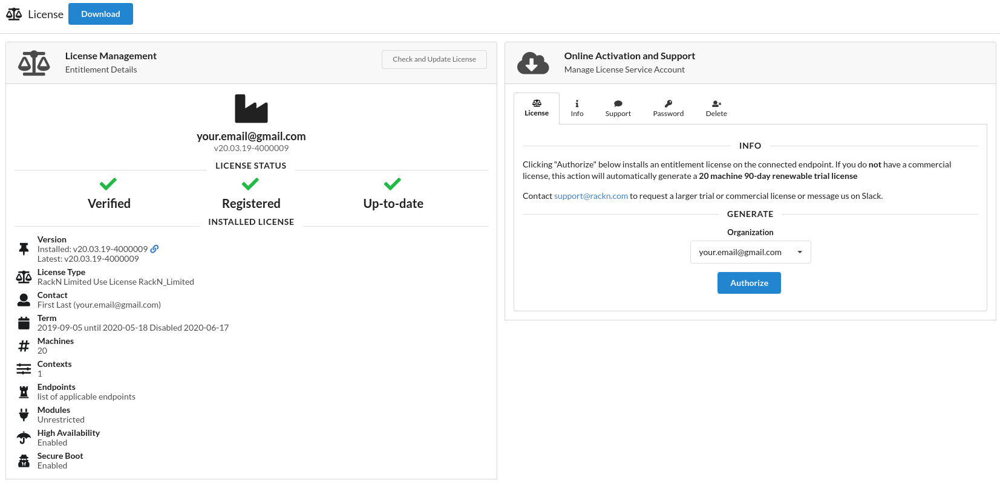
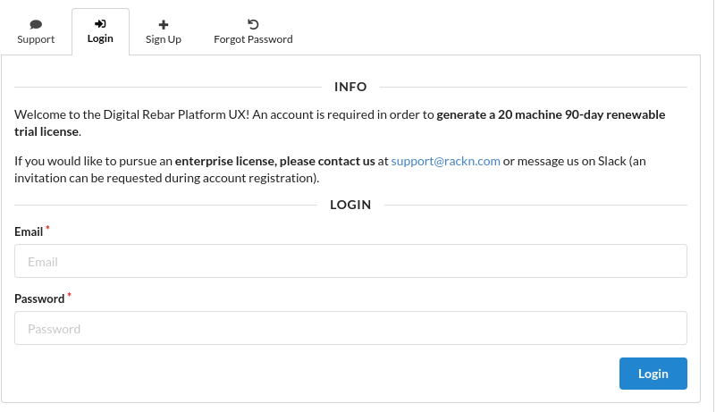
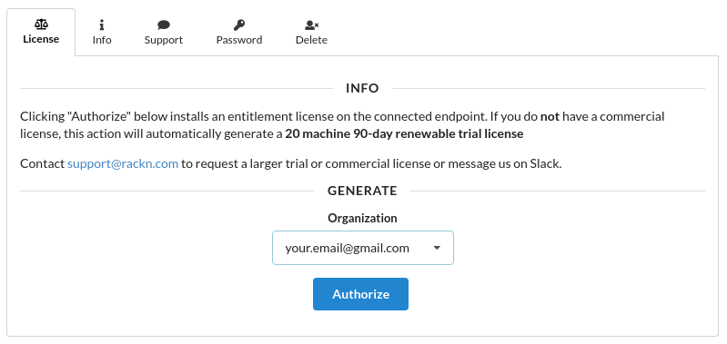

.. Copyright (c) 2017 RackN Inc.
.. Licensed under the Apache License, Version 2.0 (the "License");
.. Digital Rebar Provision documentation under Digital Rebar master license
.. index::
  pair: Digital Rebar Provision; UX

.. _rs_systemux:

System
=======

This part of the RackN Portal contains a quick overview of key activities being managed by Digital Rebar Provision including all machines, machine stages, machine activity, bulk actions on those machines, plugins, and the Information and Preferences screen. The Information and Preferences screen is the default home page at login.

Video: Why RackN built the Portal https://youtu.be/levzBw5t7gc.

Overview
--------
The Overview page shows a live view of all the active machine stages running via the RackN Portal including their State and BootEnv settings. The page also shows the running machines activity.

The top of the page offers the following services via a single blue button for each action:

* Refresh - Refresh the content on the active page
* Add Machine - Add a new machine via the RackN Portal
* Add Stage - Add a new stage into the Workflow process
* Add Profile - Add a new profile to the RackN Portal

.. _rs_ux_machines:

Machines
--------

The Machines page highlights the following information for all machines/nodes the Digital Rebar Provision endpoint is currently aware of. Information shown for each machine:

* Machine Runnable Status (Active/Standby)
* A Per-Machine Customizable Icon based on the meta data section
* Locked Status of the Machine
* Name of the Machine
* IP Address
* Profiles
* Current Active Context
* Current Workflow, Stage, and Task
* BootEnv

Selecting a machine name will provide additional information in a new screen:

* Name of the Machine
* UUID
* Description
* IP Address
* Context
* Workflow
* Workflow Stage
* Boot Environment (local/ )
* Tasks
* Profiles
* Additional Parameters

The top of the page offers the following services via a single button for each action:

* Refresh - Refesh the content on the page to show all machines managed by the RackN Portal
* Filter - Allows the user to show a specific set of machines based on a variety of filters including IP Address, BootEnv, Key, Name, Stage, UUID, Workflow,etc
* Add - Add a new machine via the RackN Portal
* Clone - Clone a machine by selecting a machine listed
* Delete  - Delete a machine by selecting a machine listed
* Show - This will show additional features for each machine including Plugin, RAM, NICs, CPUs, Make, and Family

Here's an overview of clickable things in the machines table. All links that do not navigate internally within the UX will open in a new tab.

Bulk Actions
~~~~~~~~~~~~
The Bulk Actions section above the machines table allows the operator to perform a series of changes to a selected machine or group of machines. Available options for machine manipulation include:

* Runnable - Select a machine or a set of machines to make them able to run or stop an active process
* Workflows - Select a machine or a set of machines to assign a specific workflow for processing
* Profiles - Select a machine or a set of machines to assign a specific profile for processing
* Params - Select a machine or a set of machines to assign a specific param for processing
* Stages - Select a machine or a set of machines to assign a specific stage for processing
* BootEnv - Select a machine or a set of machines to assign a specific boot environment for processing
* Context - Select a machine or a set of machines to assign a specific context for processing
* Lock - Select a machine or a set of machines to be locked or unlocked
* Actions - Select a machine or a set of machines to perform an action such as poweron, poweroff, powercycle, createVM, startVM, stop VM, destroyVM, nextbootpxe or nextbootdisk

Plugins
-------
The Plugin page lists all currently available plugins in the RackN Portal. For each plugin listed the following is included:

* Lock - The plugin is available or disabled/locked for your use
* Name - The name of the plugin
* Params - The assigned params for the plugin
* Description - Details about the plugin
* Provider - The name of the Profile that allows a machine to use the plugin

The top of the page offers the following services via a single button for each action:

* Refresh - Refresh the content on the page
* Add - Select a new plugin to add from the Select Plugin Provider page
* Clone - Make a duplicate of a specific plugin or set of plugins
* Delete - Remove a plugin or set of plugins from the RackN Portal

Info & Preferences
------------------
The System Info and Preferences page gives a complete high level overview of all activities in the RackN Portal. It is divided into four sections:

* System Wizard
* Version Inspection
* System Preferences
* System Diagnostics

**System Wizard**
This section contains status information on the availability of the RackN Portal to function. All sections should have a green checkmark unless you are working with a Packet.net or other external environment where a network is not required in which case Subnets will have a red X.

These items are given status for availability:

* Default Password
* Content
* Boot Environment
* Subnets
* ISOs
* Preferences
* Workflows
* Machines

**Version Inspection**
This section contains a list of plugins currently available to the RackN Portal for usage. A Refresh button is available to have the system recheck this information.

**System Preferences**
This section allows the operator to set a variety of global properties for the RackN Portal. A Save button is available to ensure all changes are saved to the system.

These are the properties available for updates:

* Default Workflow
* Default Stage
* Default BootEnv
* Known Token Timeout
* Unknown Token Timeout
* Unknown BootEnv
* BootEvn Logs
* DHCP Logs
* Renderer Logs
* Debug Frontend
* Debug Plugins
* Default Log Level

**System Diagnostics**
This section contains information the system itself including:

* Version tip - Build # of the Digital Rebar Provision being operated by the RackN Portal
* Feature Flags - The list of features supported in the RackN Portal for the connected Digital Rebar Provision instance.
* Endpoint MAC Address and API Port - Machine information on the DRP Endpoint the RackN Portal is connected to
* OS and Architecture - The Operating System and Processor of the Endpoint machine

The top of the page offers the following services via a single button for each action:

* Refresh - Refresh the content on the page

License Manager
---------------
The License Manager page assists in acquiring RackN issued licenses and managing a currently installed license.

The left panel shows current entitlement information:

* **Header**: License owner, license icon, and license version
* **License Status**: License verified, registration, and renewal status. If any of these three icons are an X, an updated license may need to be installed either through the "Check and Update License" button in the header or by the "Authorize" button in the License tab of the RackN Service section.
* **Installed License**: Overviews the terms of the license. Maximum number of machines can be seen next to the # icon in the "Machines" subsection.

A copy of the installed license can be downloaded at any time with the blue "Download License" button at the top of the view.

The right panel manages RackN Service Accounts.

The support tab allows users to contact RackN directly. Please provide a means of contact so we can get back to you. RackN support is available Monday thru Friday 8am-5pm CT.

Upon sign up, a Community Slack invitation can be requested in the respective checkbox.

License Authorization
~~~~~~~~~~~~~~~~~~~~~
Licenses can be authorized through the License tab on the right side of the License Manager view when signed into a RackN Service Account. Clicking the blue "Authorize" button as shown below will download and synchronize a license from RackN to the endpoint the UX is currently connected to.

By default, all licenses generated through this means are 20 machine 90-day trial licenses.
