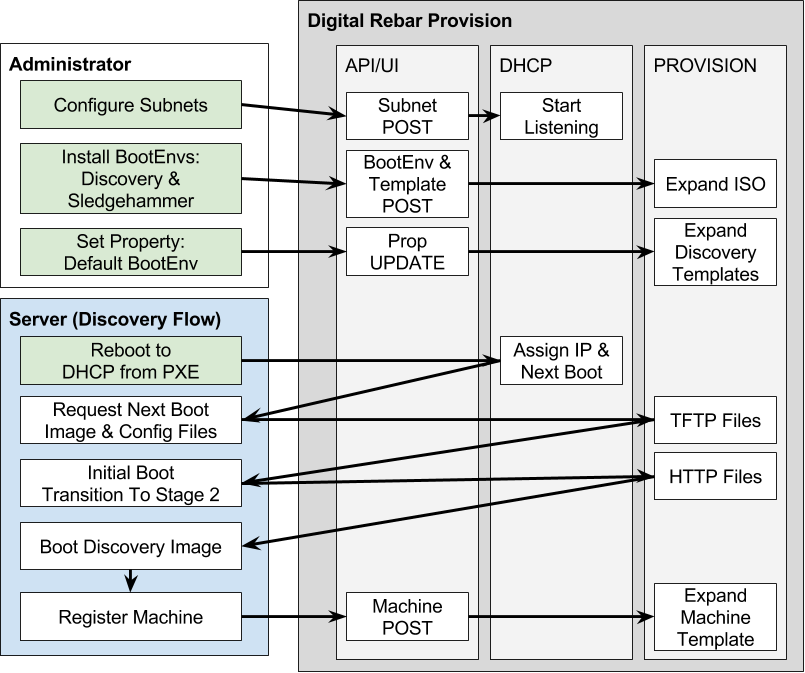
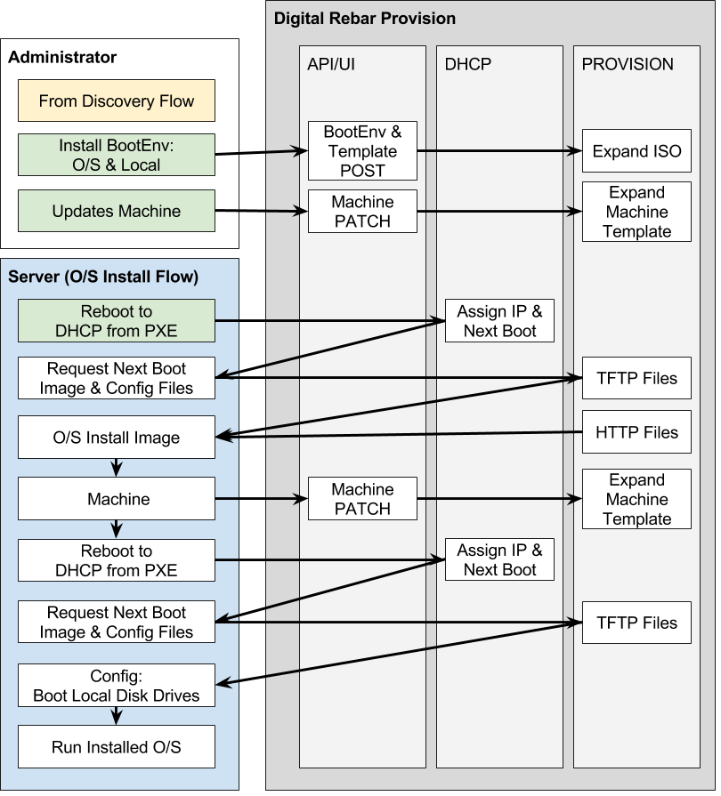

.. Copyright (c) 2017 RackN Inc.
.. Licensed under the Apache License, Version 2.0 (the "License");
.. Digital Rebar Provision documentation under Digital Rebar master license
.. index::
  pair: Digital Rebar Provision; Workflows

.. _rs_network_workflows:

Digital Rebar Provision Workflows
~~~~~~~~~~~~~~~~~~~~~~~~~~~~~~~~~

PXE Provisioning requires hand-offs between multiple services and the nodes.  Generally, these flows start with network discovery (DHCP) providing a "next boot" instruction to the server's pre-execution environment (PXE) that can download a very limited operating system using a very simple file transfer protocol (TFTP).  That next operating system can then take more complex actions including using HTTP to download further files.

.. note:: Digital Rebar Provision does not provide out-of-band management or orchestration in the Open Source version.  See the RackN based advanced plugins for power management capabilities.

In the flow graphics, green steps indicate user actions.

.. _rs_basic_discovery:

Basic Discovery
---------------

The basic discovery flow uses the specialized Discovery and Sledgehammer Boot Environments (BootEnvs).  These BootEnvs work with the default next boot to self-register machines with Digital Rebar Provision using the Machines API.

This recommended process allows operators to start with minimal information about the environment so they can :ref:`rs_provision_discovered`.  Without discovery, operators must create machines in advance following the :ref:`rs_provision_known` process.

.. _rs_provision_discovered:

Provision O/S on Discovered Systems
-----------------------------------

Once systems have been discovered using :ref:`rs_basic_discovery`, their machine BootEnv can be set to an O/S installation image.  The recommended BootEnvs for these images includes an automatic machines API call that sets the machine to boot to local disk (BootEnv = local).

.. _rs_provision_known:

Provision O/S on Known Systems
------------------------------

:note: This workflow requires users to know their machine information in advance.

This is the typical workflow for Cobbler users in which machine definitions are determined in advance using spread sheets, stone tablets, Ouija boards or other 1990s data center inventory management techniques.

Two advantages to this approach is that it skips the discovery boot process; consequently, it is faster and can be run without DHCP.

.. figure::  images/install_known.png
   :alt: Install O/S to Known Machine

